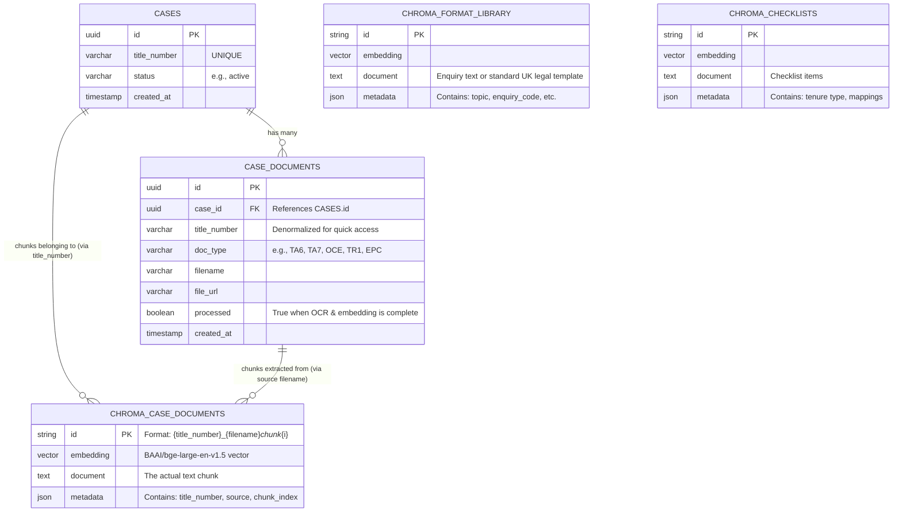

# Convey-AI Entity-Relationship Diagram (ERD)

This document outlines the data model for the Convey-AI platform. The system uses a hybrid database architecture:
1. **Supabase (PostgreSQL)** for structured, relational metadata and state.
2. **ChromaDB (Vector DB)** for semantic search over unstructured text and document chunks.

## Architectural Notes

### PostgreSQL (Supabase)
*   **`cases`**: The root entity for a conveyancing matter. Identified primarily by the UK Land Registry `title_number` (e.g., "EX332661"). 
*   **`case_documents`**: Stores metadata about uploaded files. The actual physical files are stored in a local directory (`data/processed_pdfs`) on the Railway volume, while the metadata points to them.

### Vector DB (ChromaDB)
*   **`case_documents` (Collection)**: When a document is processed, its text is chunked and stored here. The `title_number` in the metadata allows the RAG pipeline to retrieve chunks strictly belonging to the active case, preventing data leakage between clients.
*   **`format_library` & `checklists` (Collections)**: Global knowledge bases. These store the standard legal texts, rules, and enquiry formats that the AI uses to evaluate case documents and draft responses. These are not tied to any specific case.
