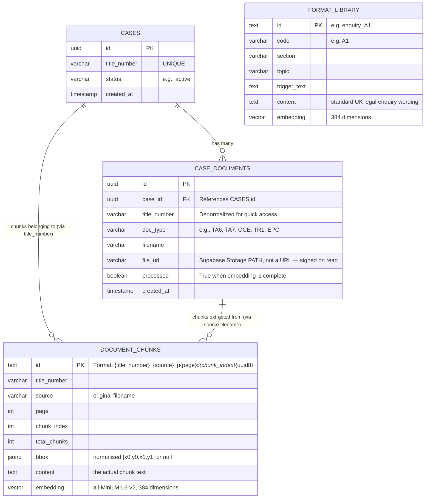

# Convey-AI Entity-Relationship Diagram (ERD)

This document outlines the data model for the Convey-AI platform. Everything lives in one Supabase project:
1. **Postgres tables** for structured, relational metadata and state.
2. **pgvector tables** (also Postgres, via the `pgvector` extension) for semantic search over unstructured text and document chunks.
3. **Supabase Storage** for the processed PDF files themselves (not shown as an ERD entity — it's a bucket keyed by `{title_number}/{filename}`, referenced from `case_documents.file_url`).

```mermaid
erDiagram
    %% SUPABASE POSTGRES — RELATIONAL SCHEMA

    CASES {
        uuid id PK
        varchar title_number "UNIQUE"
        varchar status "e.g., active"
        timestamp created_at
    }

    CASE_DOCUMENTS {
        uuid id PK
        uuid case_id FK "References CASES.id"
        varchar title_number "Denormalized for quick access"
        varchar doc_type "e.g., TA6, TA7, OCE, TR1, EPC"
        varchar filename
        varchar file_url "Supabase Storage PATH, not a URL — signed on read"
        boolean processed "True when embedding is complete"
        timestamp created_at
    }

    %% SUPABASE POSTGRES — PGVECTOR TABLES
    %% Represented here as entities to show relationships

    DOCUMENT_CHUNKS {
        text id PK "Format: {title_number}_{source}_p{page}_c{chunk_index}_{uuid8}"
        varchar title_number
        varchar source "original filename"
        int page
        int chunk_index
        int total_chunks
        jsonb bbox "normalised [x0,y0,x1,y1] or null"
        text content "the actual chunk text"
        vector embedding "all-MiniLM-L6-v2, 384 dimensions"
    }

    FORMAT_LIBRARY {
        text id PK "e.g. enquiry_A1"
        varchar code "e.g. A1"
        varchar section
        varchar topic
        text trigger_text
        text content "standard UK legal enquiry wording"
        vector embedding "384 dimensions"
    }

    %% RELATIONSHIPS

    CASES ||--o{ CASE_DOCUMENTS : "has many"

    %% Conceptual relationships bridging the relational and pgvector tables
    %% (no real foreign key — joined by title_number / filename at query time)
    CASES ||--o{ DOCUMENT_CHUNKS : "chunks belonging to (via title_number)"
    CASE_DOCUMENTS ||--o{ DOCUMENT_CHUNKS : "chunks extracted from (via source filename)"
```

## Architectural Notes

### Postgres — relational tables
*   **`cases`**: The root entity for a conveyancing matter. Identified primarily by the UK Land Registry `title_number` (e.g., "EX332661").
*   **`case_documents`**: Stores metadata about uploaded files. The physical PDF bytes live in a private **Supabase Storage** bucket (`case-documents`), keyed by `{title_number}/{filename}`; `file_url` stores that path, not a public link. A fresh 1-hour signed URL is minted from the path every time `database.get_case()` returns documents to the frontend, so the bucket never needs to be public.

### Postgres — pgvector tables
*   **`document_chunks`**: When a document is processed, its text is chunked and embedded here. The `title_number` column lets the RAG pipeline retrieve chunks strictly belonging to the active case, preventing data leakage between clients. Similarity search runs via the `match_document_chunks` SQL function (`supabase.rpc(...)`); non-similarity lookups (e.g. "every chunk of this document, in order") use a plain filtered `select`.
*   **`format_library`**: A global knowledge base — standard legal texts, rules, and enquiry formats the AI uses to evaluate case documents and draft responses. Not tied to any specific case. Searched via the `match_format_library` function, or looked up deterministically by `id`/`code`.
*   A third collection, `checklists`, existed in an earlier ChromaDB-based version of this schema but was dropped during the move to pgvector — it was created but never actually written to or queried by any code path.

### Why pgvector instead of a separate vector database
This system previously ran ChromaDB embedded in-process on the Railway backend, persisted to a Railway volume. That meant the vector index's memory footprint competed with the FastAPI app for RAM on a memory-constrained host, and required a persistent volume Railway had to manage. Moving vectors into Supabase Postgres (alongside the relational tables and Storage, which were already there) removes that memory pressure from the app process and means the backend holds no persistent state of its own — only the embedding *model* (SentenceTransformer) still runs in-process, since text has to be turned into a vector before it can be written to or queried from Postgres.
